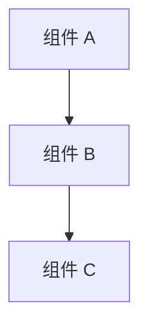

# 文档标题

## 概述

简要描述本文档的内容和目的。

## 背景

解释为什么需要这个功能/组件/模块，解决什么问题。

## 设计

### 架构图



### 关键概念

| 概念 | 说明 |
|------|------|
| Concept A | 概念 A 的说明 |
| Concept B | 概念 B 的说明 |

## API

### 端点列表

| 方法 | 路径 | 说明 |
|------|------|------|
| GET | `/api/resource` | 获取资源列表 |
| POST | `/api/resource` | 创建新资源 |

### 请求/响应示例

#### 获取资源列表

**请求**

```bash
$ curl -X GET http://localhost:3000/api/resource \
  -H "Authorization: Bearer <token>"
```

**响应**

```json
{
  "success": true,
  "data": {
    "items": [...],
    "total": 10
  }
}
```

## 实现

### 文件结构

```
src/
├── module/
│   ├── handler.ts    # 请求处理
│   ├── service.ts    # 业务逻辑
│   └── types.ts      # 类型定义
```

### 关键代码

```typescript
// 代码示例
export async function handleRequest(c: Context) {
  // 实现...
}
```

## 相关文档

- [相关文档 A](./other-page.md)
- [CLAUDE.md - 项目指南](../../../CLAUDE.md)
